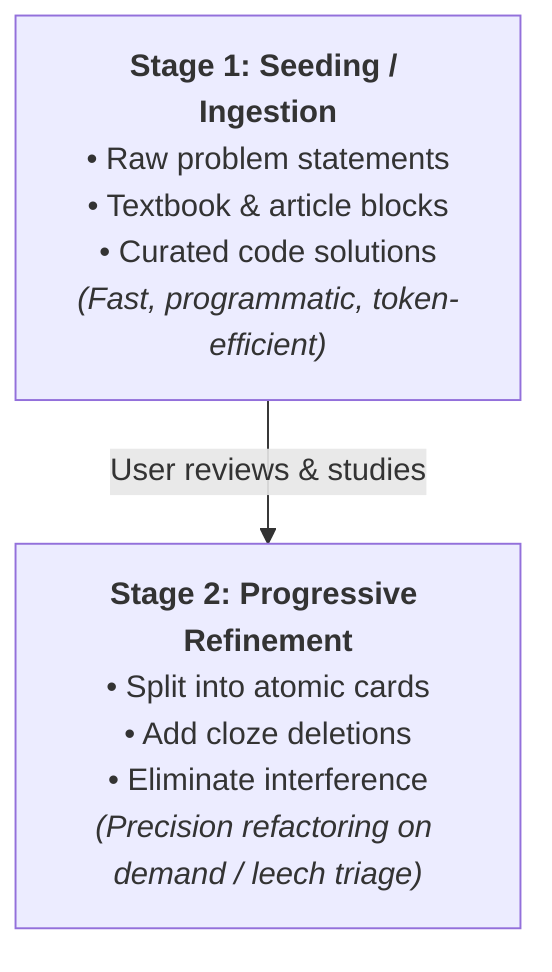

# Pragmatic Knowledge Formulation for Agents

This guide translates spaced-repetition formulation principles (inspired by SuperMemo's *Twenty Rules of Formulating Knowledge*) into pragmatic, token-efficient directives for agents authoring and refactoring Anki flashcards.

---

## 1. The Evolutionary Card Lifecycle

Academic flashcard literature often insists on perfect atomicity and complete comprehension before writing a card. In real-world technical learning, cards follow an **evolutionary lifecycle**:



1. **Learning Can Start Directly in Anki:** Anki cards frequently start out as rich reading material, complex coding problem descriptions (e.g., NeetCode/LeetCode problems), or reference snippets.
2. **Token Efficiency During Bulk Ingestion:** When asked to ingest 50+ or 100+ cards, the agent should **not** waste hundreds of thousands of tokens analyzing and "deeply comprehending" each problem ahead of time. Use concise Python scripts or fast JSON generation to transfer the structured payload directly into the Anki collection.
3. **Refactoring on Demand:** Polish, atomicity, and memory techniques are applied when the user requests refinement or when cards fail review and become leeches (`prop:lapses>4`).

---

## 2. Core Card Formulation Directives

### 2.1 Minimum Information Principle (The North Star, Not a Blocker)
* **Principle:** When optimizing cards for long-term retention, an ideal card tests **one** atomic concept, relationship, or retrieval cue.
* **Practice:** Start as rich or broad as needed during initial ingestion. When a card feels clumsy during review or has multiple lapses, split it into smaller, focused cards.

### 2.2 Sets & Enumerations: Pragmatic Bounds
* **Myth:** *"Never create a card that asks for a set or list."*
* **Reality:** Small sets (2 to 4 tightly coupled items) and short sequences are completely acceptable.
  * *Acceptable set:* *"What are the 3 states of a TCP connection closing handshake? FIN, ACK, TIME_WAIT."*
  * *Problematic set (decompose this):* Asking for 7+ items without order (e.g., *"Name all 14 POSIX signals"*). Decompose into purpose-driven 1-to-1 questions: *"Which signal cannot be caught or ignored? SIGKILL"*.

### 2.3 Context Cues & Scope Tags
* Put the domain in brackets at the beginning of the question or use hierarchical tags.
* *Without context cue (confusing):* `"What is the time complexity of sort()?"` (Depends on language/algorithm).
* *With context cue (clear & fast):* `"[Python Timsort] What is the worst-case time complexity of list.sort()?"`
* *Hierarchical Tags:* `cs::algorithms::sorting`, `devops::k8s::networking`.

### 2.4 Optimize Wording (Zero Conversational Fluff)
* Flashcard questions must be punchy and direct. Never include conversational filler like:
  * ❌ *"Can you please explain what the primary difference between a process and a thread is?"*
  * ✅ `"[OS] Primary memory distinction between a Process and a Thread?"`
* Strip redundant background narrative from the front. Put optional context or explanatory notes in the `Back` or `Extra` field.

### 2.5 Combat Interference (Contrastive Pairing)
* Interference occurs when two similar concepts are confused (e.g., `BFS vs. DFS`, `shallow copy vs. deep copy`, `symmetric vs. asymmetric encryption`, `map vs. flatMap`).
* **Fix:** When cards for similar concepts struggle, formulate an explicit contrast question:
  * Front: `"[Python] How does copy.copy() differ from copy.deepcopy() when handling nested mutable objects?"`
  * Back: `copy() copies the container but references nested objects; deepcopy() recursively clones all nested objects.`

### 2.6 Planned Redundancy (Multi-Angle Retrieval)
* Redundancy is beneficial when approaching a concept from distinct angles:
  * **Angle 1 (Concept -> Syntax/Code):** *"How do you declare a frozen dataclass in Python?"*
  * **Angle 2 (Code -> Behavior):** *"What happens if you attempt to mutate an attribute on `@dataclass(frozen=True)`?"*
  * **Angle 3 (Use Case):** *"Why would you mark a dataclass as frozen when using it as a dictionary key?"*

### 2.7 Sources & Version Stamping
* When facts depend on library versions or API revisions, record the version in the card:
  * Front: `"[Python 3.12+] How do you declare a generic function using the type parameter syntax?"`
  * Extra / Source: `PEP 695 (Python 3.12)`
* Place documentation URLs and book references in the `Extra` field rather than on the active question face.

---

## 3. Formatting Standards for Cards

### 3.1 Cloze Deletions
Use standard Anki cloze syntax:
* `{{c1::hidden text}}`
* With hint: `{{c1::hidden text::hint}}`
* Multiple cards from one note:
  ```text
  Text: "In a binary search tree, the left subtree contains keys {{c1::smaller}} than the root, while the right subtree contains keys {{c2::greater}}."
  ```

### 3.2 LaTeX Math Formulas
* **Inline Math:** Wrap in single dollar signs: `$O(n \log n)$` or `$\lambda \in \mathbb{R}$`.
* **Block / Display Math:** Wrap in double dollar signs:
  ```text
  $$\nabla \cdot \mathbf{E} = \frac{\rho}{\varepsilon_0}$$
  ```
* **JSON Escaping:** Remember that backslashes in JSON strings must be escaped: `"$\\mathcal{O}(n^2)$"`.

### 3.3 Code Blocks
Always use clean semantic HTML `<pre><code>...</code></pre>` tags for multi-line code blocks so Anki desktop and mobile apps render them cleanly without formatting breakage:
```html
<pre><code>def two_sum(nums: list[int], target: int) -> list[int]:
    seen = {}
    for i, num in enumerate(nums):
        if target - num in seen:
            return [seen[target - num], i]
        seen[num] = i
    return []
</code></pre>
```

